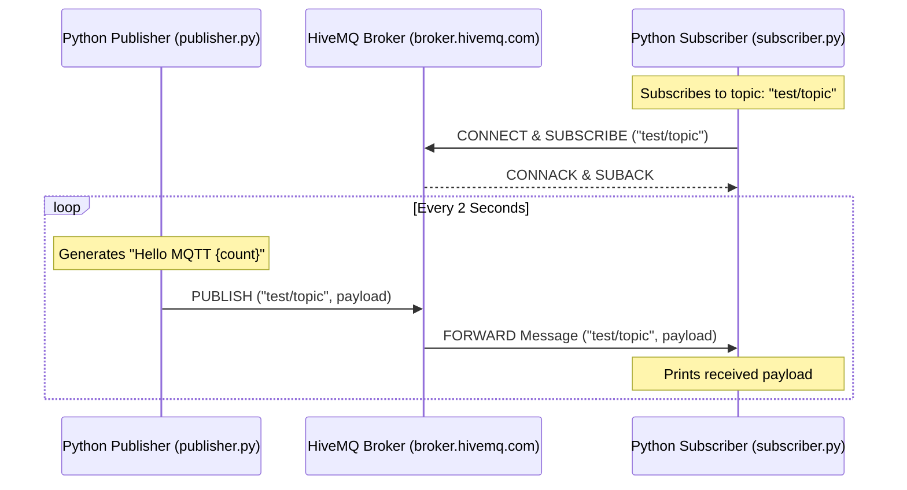

# IoT MQTT Messaging System with HiveMQ

[](https://mqtt.org/)
[](https://pypi.org/project/paho-mqtt/)
[](https://www.hivemq.com/public-mqtt-broker/)

A lightweight Python implementation of the Publish/Subscribe messaging pattern using the **MQTT (Message Queuing Telemetry Transport)** protocol, configured to interact with the public **HiveMQ** broker.

---

## 📡 Architecture Workflow



---

## 📁 Repository Structure

```
mqtt-hivemq/
├── publisher.py       # Publishes telemetry data to the broker
├── subscriber.py      # Subscribes to the broker and prints message streams
├── .gitignore         # Prevents committing temporary local files
└── README.md          # Project documentation
```

---

## 🧰 Setup & Run Instructions

### 1. Prerequisites
Make sure python is installed on your machine. Install the Eclipse Paho MQTT python client:
```bash
pip install paho-mqtt
```

### 2. running the Subscriber
Run the subscriber script first. It will listen for incoming data packages on the `test/topic` topic:
```bash
python subscriber.py
```
**Expected Output:**
```
Connected with result code 0
Received `Hello MQTT 0` from `test/topic` topic
```

### 3. running the Publisher
In a separate terminal shell, execute the publisher script to start transmitting telemetry:
```bash
python publisher.py
```
**Expected Output:**
```
Sent `Hello MQTT 0` to topic `test/topic`
Sent `Hello MQTT 1` to topic `test/topic`
```

---

## 🔐 Production Considerations
For production IoT telemetry:
* Replace `broker.hivemq.com` (public) with a secure, private broker (e.g. HiveMQ Cloud, AWS IoT Core).
* Enable SSL/TLS encryption (usually port `8883` instead of standard non-encrypted `1883`).
* Use certificate-based authentication or credential pairs (username/password).
